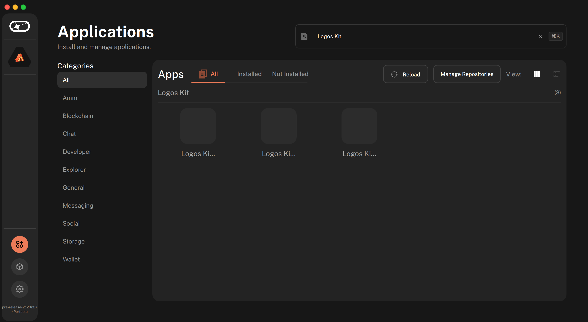
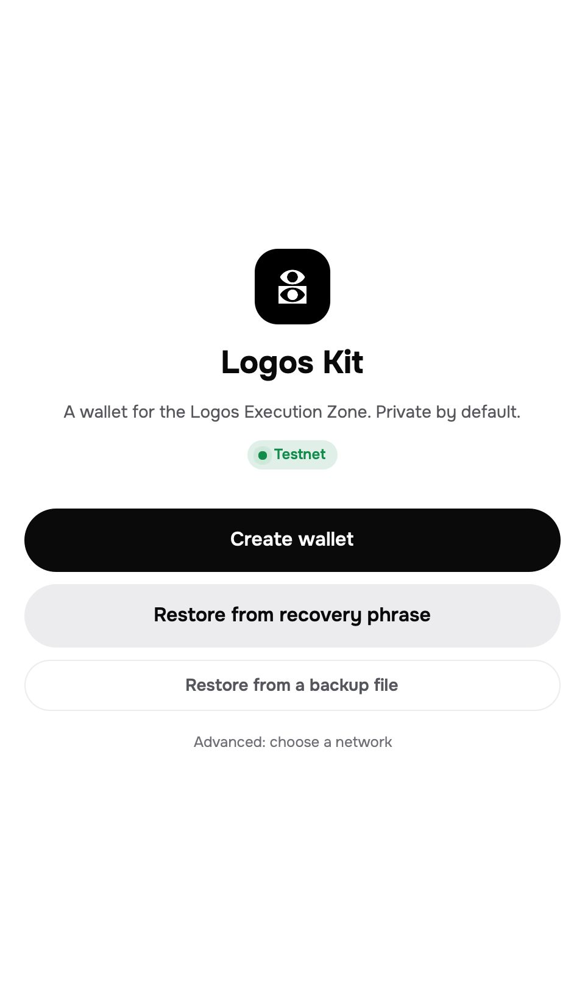
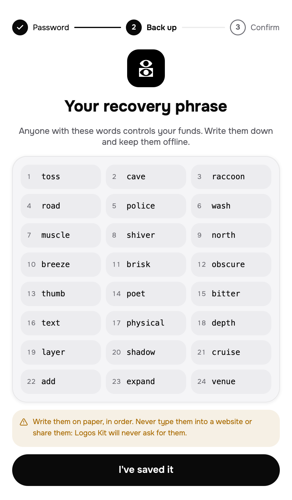
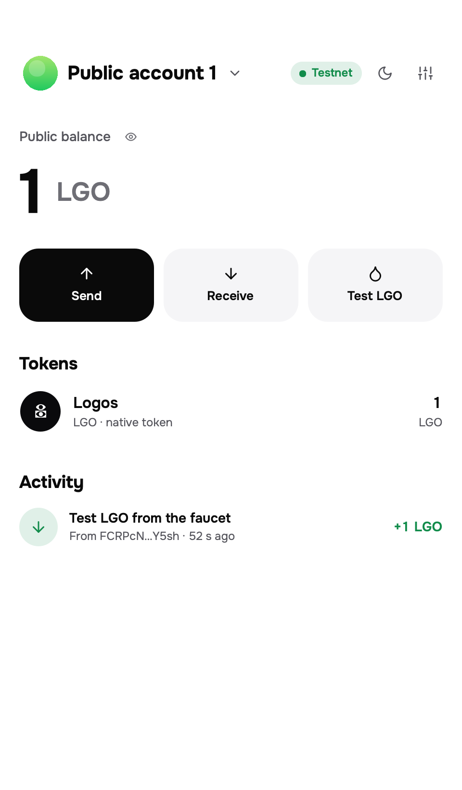
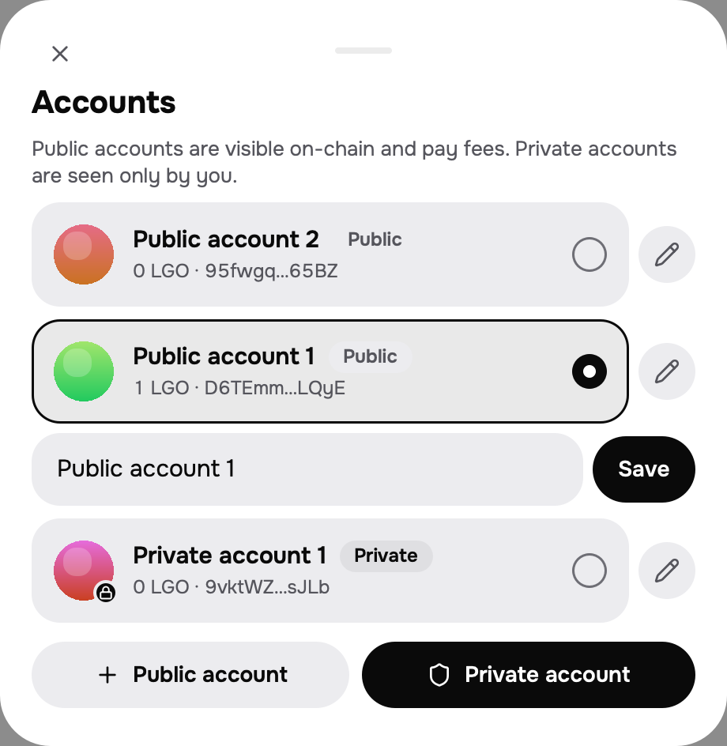
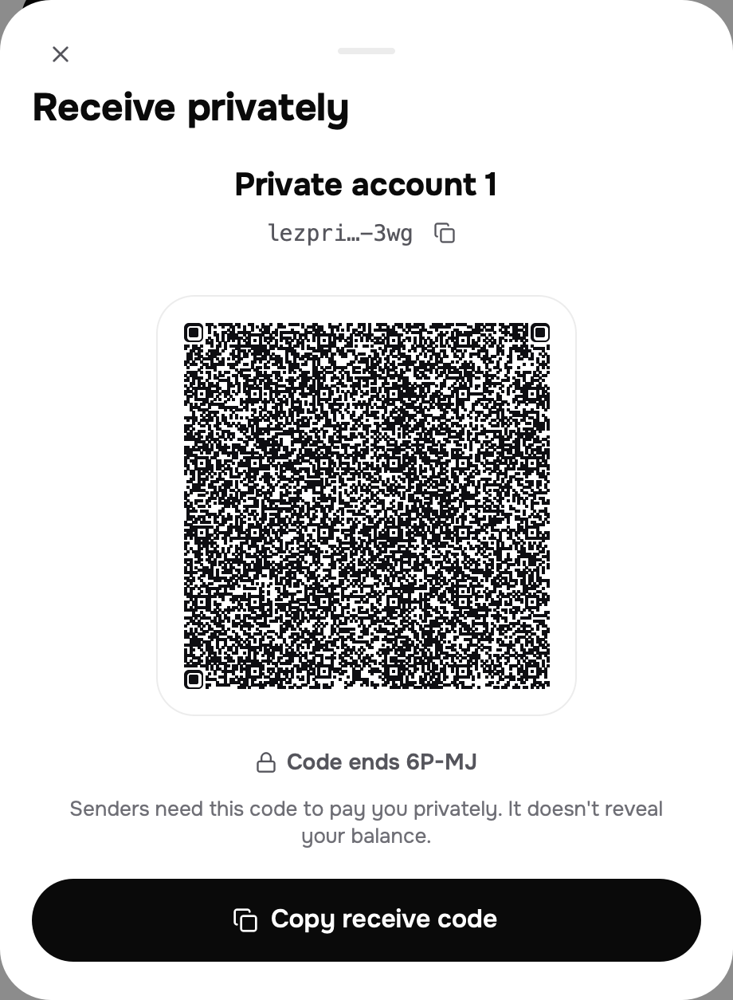
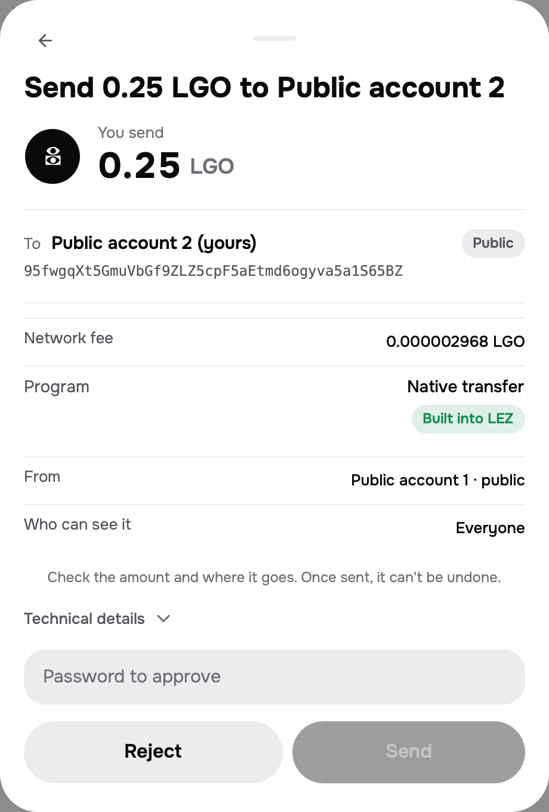
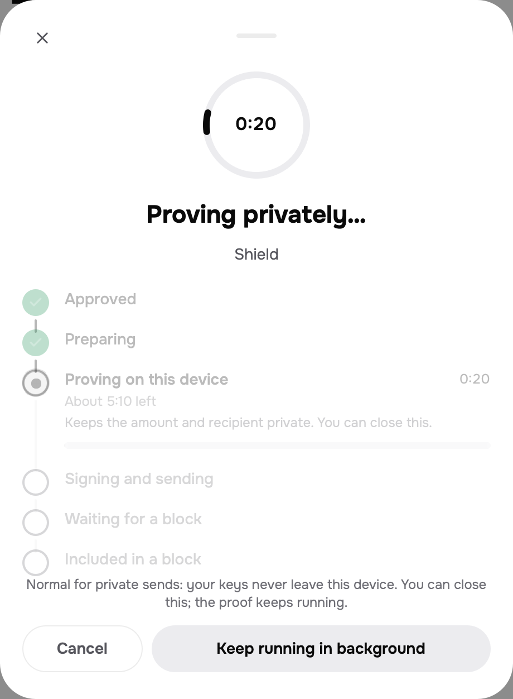

<p align="center">
  <a href="https://logos-kit-docs.vercel.app"><picture><source media="(prefers-color-scheme: dark)" srcset="docs/assets/readme/logo-dark.svg"></picture></a>
</p>

<h1 align="center">Logos Kit</h1>

<p align="center">A wallet and app SDK for the Logos Execution Zone</p>

<p align="center">
  <a href="https://github.com/logos-kit/logos-kit/actions/workflows/e2e.yml"><picture><source media="(prefers-color-scheme: dark)" srcset="https://img.shields.io/github/actions/workflow/status/logos-kit/logos-kit/e2e.yml?branch=main&label=e2e&colorA=21262d&style=flat"></picture></a>
  <a href="https://www.npmjs.com/package/@logos-kit/client"><picture><source media="(prefers-color-scheme: dark)" srcset="https://img.shields.io/npm/v/%40logos-kit%2Fclient?label=%40logos-kit%2Fclient&colorA=21262d&colorB=21262d&style=flat"></picture></a>
  <a href="#license"><picture><source media="(prefers-color-scheme: dark)" srcset="https://img.shields.io/badge/license-MIT%20OR%20Apache--2.0-21262d?colorA=21262d&style=flat"></picture></a>
  <a href="https://github.com/logos-kit/logos-kit-modules"><picture><source media="(prefers-color-scheme: dark)" srcset="https://img.shields.io/badge/Basecamp-catalog-21262d?colorA=21262d&style=flat"></picture></a>
  <a href="https://logos-kit-docs.vercel.app/docs"><picture><source media="(prefers-color-scheme: dark)" srcset="https://img.shields.io/badge/docs-logos--kit--docs-21262d?colorA=21262d&style=flat"></picture></a>
</p>

<p align="center">
  <a href="https://logos-kit-docs.vercel.app/docs"><b>Docs</b></a> · <a href="https://logos-kit-docs.vercel.app/docs/getting-started/quickstart">Quickstart</a> · <a href="#examples">Examples</a> · <a href="https://github.com/logos-kit/logos-kit-modules">Catalog</a> · <a href="CHANGELOG.md">Changelog</a>
</p>

<p align="center">
  
</p>

> [!WARNING]
> Testnet only, and not audited. Logos Kit runs on the official LEZ testnet 0.3 by default. Don't use it for anything of value.

Logos Kit is a wallet for the Logos Execution Zone (LEZ, where Logos apps and programs run) that works inside Logos Basecamp (the Logos desktop app) and in a terminal, plus the SDK that Basecamp apps use to ask it for accounts and approvals.

- **Public and private accounts.** Many of each, from one recovery phrase. Public accounts are visible on chain; private ones only to you.
- **LGO and tokens on every route.** Public sends, shield (public to private), deshield (private to public) and private to private. Private transactions are proved on your own machine.
- **Approvals you can read.** The wallet decodes the exact transaction it will sign: the asking app, the amount, the destination, the fee, and whether the program was rebuilt from its source and matched.
- **Apps ask, you decide.** Apps see only the accounts you share, and private ones only as per-app handles. Keys never leave the wallet's core module.
- **An SDK for Basecamp apps.** A QML SDK (connect, read, propose, follow), an app template, a fake wallet to test against, and TypeScript packages on npm.
- **A CLI on the same engine.** `logos-kit` uses the same engine and approval policy, with `--json` output for scripts.

## Quick start

**The wallet in Basecamp**

1. In Basecamp, open **Settings → Package Repositories → Add** and paste:
   ```text
   https://raw.githubusercontent.com/logos-kit/logos-kit-modules/refs/heads/main/logos-repo.json
   ```
2. Open **Applications → Logos Kit Wallet → Install**.
3. Open the wallet, choose **Create wallet**, save the recovery phrase, then press **Get test LGO**.

**The CLI**

```sh
git clone https://github.com/logos-kit/logos-kit && cd logos-kit
scripts/lez-vendor.sh                       # fetch the pinned LEZ source into vendor/lez
cargo install --path crates/logos-kit-cli
logos-kit init && logos-kit account new     # prints your first account
logos-kit faucet <account>                  # 1 test LGO
```

**A Basecamp app**

```sh
mkdir my-app && cd my-app
nix flake init -t github:logos-kit/logos-kit#dapp
nix build .#lgx-portable                    # → result/*.lgx, install it from Basecamp's Package Manager
```

## Setup

| For | You need |
|---|---|
| The wallet | Logos Basecamp on macOS (Apple silicon) or Linux (x86-64, arm64) |
| Private transactions | Time and memory for a local proof. Measured on an M1 Pro with 16 GB: 267–337 s for a shield, 469 s fully private, 4.3 GB peak resident memory (about 10 GB counting compressed and swapped pages) |
| The CLI | Rust 1.98.1 (`rustup` reads it from `rust-toolchain.toml`) and git; Xcode command-line tools on macOS; `clang`, `libclang-dev`, `cmake`, `pkg-config` and `libssl-dev` on Linux |
| Building apps and modules | [Nix](https://nixos.org/download) with flakes |
| Rebuilding a program to verify it | Docker |

**Install.** The wallet installs from the Logos Kit catalog, as in the quick start; every package is signed by the Logos Kit release key. The CLI builds from source; there are no prebuilt binaries. To build the Basecamp modules yourself, see [`modules/README.md`](modules/README.md).

**Networks.** The wallet, the CLI and the SDK use the official LEZ testnet 0.3 (`https://testnet.lez.logos.co`, chain `lez:testnet`) by default. Switch in **Settings → Network**, or with `--zone` / `LOGOS_KIT_ZONE` in the CLI. `lez-local` is a sequencer (the node that orders transactions) on your own machine, which `e2e/standalone.sh` starts on port 3040. `lez-preview` is Logos Kit's earlier test network, kept for wallets that saved it. The CLI adds any other zone with `--zone <id> --sequencer <url>`, and SDK apps follow the wallet's network. The native token is LOGOS (LGO); amounts on the wire are lepta, and 1 LGO = 10^9 lepta. Hosts, faucets and the explorer: [Networks](https://logos-kit-docs.vercel.app/docs/concepts/networks).

## Accounts

| Task | Basecamp | CLI |
|---|---|---|
| Create a wallet | **Create wallet** (makes one public and one private account) | `logos-kit init` |
| Restore from the phrase | **Restore from recovery phrase**, with an optional first-use date | `logos-kit restore --from-date 2026-10-01`, then `logos-kit sync` |
| Add a public account | Account name at the top → **Public account** | `logos-kit account new` |
| Add a private account | Account name at the top → **Private account** | `logos-kit account new --private` |
| Name an account | Pencil next to it → **Save** | `logos-kit account label <account> "Savings"` |
| Switch or list | Account name at the top | `logos-kit account list`; commands take `--from <account>` |
| Get paid privately | **Receive** on a private account → **Copy receive code** | `logos-kit account keys <account> > keys.txt` |
| Import a public key | — | `logos-kit account import` |
| Show the phrase | **Settings → Recovery phrase** (asks the password) | `logos-kit reveal` |
| Back up | Write the phrase down | `logos-kit backup export wallet.backup` (encrypted) |
| Auto-lock | **Settings → Auto-lock** (5 min, 15 min, 1 h; 15 min by default) | `logos-kit auto-lock 900` (60–86400 s) |
| Disconnect an app | **Settings → Connected apps → Revoke** | — (apps connect only in Basecamp) |

## Use it in Basecamp, step by step

1. **Install.** Add the catalog URL above under **Settings → Package Repositories**, then **Applications → Logos Kit Wallet → Install**. The core module, `logos_kit_wallet`, comes with it.<br>
2. **Create the wallet.** Choose **Create wallet** and pick a password of 8 or more characters.<br>
3. **Save the recovery phrase.** Press **Reveal**, write the 24 words on paper, press **I've saved it**, then type the three words it asks for. Anyone with these words controls your funds.<br>
4. **Get test LGO.** Press **Get test LGO** on the last setup screen, or **Test LGO** at home. Logos Kit's faucet sends 1 LGO to your public account, once an hour per account; on the testnet it can take a minute or more.<br>
5. **Add and name accounts.** Tap the account name at the top, then **Public account** or **Private account**. The pencil renames an account; tapping one switches to it.<br>
6. **Receive.** **Receive** shows the address and a QR code. A private account shows a receive code (`lezpriv1:…`) instead: senders need it to pay you privately, and it doesn't reveal your balance.<br>
7. **Send.** Press **Send**, paste an address or receive code (or pick one of your accounts), choose the asset, press **Continue**, type the amount and press **Review**. Check what will be signed and the fee, then press **Send**.<br>
8. **Go private.** Send from a public account to one of your private accounts (a shield). **Prove and send** proves it on your machine, which takes minutes; it can keep running in the background.<br>
9. **Use an app.** Install **Logos Kit Testimonials** from the same catalog. **Connect wallet** opens the wallet: pick the account to share and press **Connect**. Write a line that mentions Logos Kit, press **Post testimonial** and approve in the wallet, which names the app, the program, its verification and the fee. The app then shows **Posted on LEZ** with an explorer link.<br>

**Settings** holds the network, theme, auto-lock, the recovery phrase and **Connected apps**, where you can revoke an app at any time.

## Use it from the CLI, step by step


```sh
logos-kit init                                       # 1. pick a password, write down the phrase
logos-kit account new                                # 2. a public account; call it A
logos-kit account new --private                      #    a private account; call it P
logos-kit faucet <A>                                 # 3. 1 test LGO from Logos Kit's faucet
logos-kit balance <A>
logos-kit send --from <A> --to <B> --amount 0.25     # 4. public send (B: any public account)
logos-kit shield --from <A> --to <P> --amount 0.5    # 5. into your private account; proves locally
logos-kit deshield --from <P> --to <A> --amount 0.1  # 6. back out to a public account
logos-kit account keys <P> > keys.txt                # 7. share this file to be paid privately
logos-kit send --from <P> --to-keys their-keys.txt --amount 0.05   # pay someone else's private account
logos-kit testimonial post --from <A> --text "I use Logos Kit wallet to …"   # 8. an on-chain testimonial
logos-kit backup export wallet.backup                # 9. encrypted backup
```

Each command that spends prints what it will sign (route, accounts, effects, the program and its verification, the fee, a request hash) and asks `Approve? [y/N]`. `--amount` reads `0.25` or `2LGO` as LGO and a whole number such as `42` as lepta. For scripts, set `LOGOS_KIT_PASSWORD` and add `--yes`; `--json` prints amounts in lepta. Every command and flag: [`crates/logos-kit-cli/README.md`](crates/logos-kit-cli/README.md).

## Build a Basecamp app

```sh
mkdir my-app && cd my-app
nix flake init -t github:logos-kit/logos-kit#dapp   # metadata.json, qml/Main.qml, the SDK in qml/LogosKit/
nix build .#lgx-portable
lgpm install --file result/*.lgx                    # or Basecamp: Package Manager → Install from file
```

```qml
import "LogosKit"

LogosKit { id: kit; visible: root.visible }

kit.api.connect({ accountKinds: ["public"] }).then(function (s) { account = s.accounts[0].address })
kit.api.transfer(account, to, kit.sdk.parseUnits("0.5", 9)).then(function (r) {
    kit.api.watchTransaction(r.handle, function (s) { status = s.lifecycle + " " + s.outcome })
})
```

List every intent (a request your app sends to the wallet, such as `lez.wallet.connect`) under `uses` in `metadata.json`. A proposal resolves when the user approves; follow it until `included`, and treat only `outcome: "success"` as done. To test against the fake wallet, with no chain and no keys, run `just qt-setup` once in a checkout of this repo, then `just conformance <app dir>`. Walkthroughs: [quickstart](https://logos-kit-docs.vercel.app/docs/getting-started/quickstart), [QML SDK](https://logos-kit-docs.vercel.app/docs/sdk/qml), [testimonial app](https://logos-kit-docs.vercel.app/docs/guides/testimonial), [faucet app](https://logos-kit-docs.vercel.app/docs/guides/faucet).

## Tokens

Tokens live in LEZ's built-in token program, and a token is named by its definition account. Create one from the CLI, and send it from either the CLI or Basecamp.

```sh
logos-kit token create --name KIT --supply 1000000 --holder <A>   # prints the definition id
logos-kit send --from <A> --to <B> --amount 250 --token <definition>
logos-kit token list
```

In Basecamp, your tokens show under **Tokens** on the home screen, and **Send** offers them in its asset picker. Token amounts are whole base units: LEZ tokens have no decimals on chain. On LEZ 0.3 an account holds LGO plus at most one other token, so send a token only to an account that holds none or the same one.

NFTs, private membership proofs and a Market are coming in the next release.

## Privacy and network calls

Logos Kit has no analytics. It talks only to the endpoints below, and only when the table says; **Settings → Privacy** in the wallet lists the ones it uses.

| Endpoint | Why | When | How to turn it off |
|---|---|---|---|
| The network's sequencer (default `https://testnet.lez.logos.co`) | Read blocks and balances, send transactions | While the wallet is unlocked; CLI commands that read or send | Use `lez-local` to keep it all on your machine |
| Logos Kit's drip faucet ([hosts](https://logos-kit-docs.vercel.app/docs/concepts/networks)) | Test LGO | Only when you press **Test LGO**, approve an app's request for funds, or run `logos-kit faucet` | Don't ask for funds; it is never called otherwise |
| `https://explorer.testnet.lez.logos.co` | Show a transaction or account | Only when you press **View on explorer** in an app; your browser opens it | Don't press it |
| Logos Kit's CORS relay for the testnet | Lets web pages read the testnet (the official RPC doesn't allow browser calls) | Never by the wallet or the CLI; only by web code that picks it, such as the docs site | Point `http()` at another URL |
| The program's git repository and the RISC Zero docker builder | Rebuild a program to check it matches what is deployed | Only when you run `logos-kit verify-program` or `logos-kit testimonial build` | Don't run them |

Private transactions are proved on your device. An app sees a private balance only after you tick a separate consent.

## Packages

| Package | What it is |
|---|---|
| `logos_kit_wallet` ([source](modules/logos_kit_wallet)) | Basecamp core module: keys, accounts, approvals, proving |
| `logos_kit_wallet_ui` ([source](modules/logos_kit_wallet_ui)) | The wallet app in Basecamp |
| `logos-kit` ([source](crates/logos-kit-cli)) | The CLI |
| `LogosKit`, `LogosKitUi` ([source](sdk/qml)) | The QML SDK and the wallet's UI components, for Basecamp apps |
| [`@logos-kit/client`](https://www.npmjs.com/package/@logos-kit/client) | Typed LEZ reads and wallet actions, for Node and tools |
| [`@logos-kit/codec`](https://www.npmjs.com/package/@logos-kit/codec) | Byte-exact LEZ encoding, with 128-bit amounts as strings |
| [`@logos-kit/protocol`](https://www.npmjs.com/package/@logos-kit/protocol) | LWS-0, the wallet protocol: types, JSON Schema, test vectors |
| [`@logos-kit/theme`](https://www.npmjs.com/package/@logos-kit/theme) | The "Ledger" design tokens, for CSS and QML |
| `logos-kit-drip` ([source](crates/logos-kit-drip)) | A testnet faucet anyone can host |

## Examples

- [`templates/basecamp-dapp`](templates/basecamp-dapp): the app template. Connect, balance, test funds, send, receipt.
- [`modules/logos_kit_testimonial`](modules/logos_kit_testimonial): Logos Kit Testimonials, an app that posts on-chain testimonials ([guide](https://logos-kit-docs.vercel.app/docs/guides/testimonial)).
- [`modules/logos_kit_faucet`](modules/logos_kit_faucet): Logos Kit Faucet, test LGO into public or private accounts, with rate limits ([guide](https://logos-kit-docs.vercel.app/docs/guides/faucet)).
- [`modules/logos_kit_wallet_fake`](modules/logos_kit_wallet_fake): a fake wallet with fixed scenarios (declined, timed out, rate-limited and more) for testing apps.

## For λPrize evaluators

Logos Kit is our entry for [LP-0021, LEZ Wallet and Provider SDK](https://github.com/logos-co/lambda-prize/blob/master/prizes/LP-0021.md).

```sh
git clone https://github.com/logos-kit/logos-kit && cd logos-kit
e2e/demo.sh --local                        # a LEZ 0.3 sequencer built from the pinned source, dev proofs
e2e/demo.sh --local --real-proofs          # the same with real RISC Zero proofs (minutes per private step)
e2e/demo.sh --preview                      # Logos Kit's legacy preview network (LEZ v0.3.0-rc1, real proofs)
LK_ZONE=lez-testnet e2e/preview-flows.sh   # the official testnet, real proofs, a fresh faucet-funded wallet
```

`demo.sh` checks the platform (macOS arm64, Linux x86-64 and aarch64) and prints an install command for each missing prerequisite. It then prints one PASS or FAIL line per step: accounts, faucet, public send, shield, private to public, token create and sends, testimonial post, evidence export, and requests the wallet must refuse (a second post, a post from a private account, an overspend and, locally, a stale approval). RISC Zero is the proof system LEZ uses; with "dev proofs" the program runs but the proof is a placeholder that a dev-mode sequencer accepts unchecked.

[](https://github.com/logos-kit/logos-kit/actions/workflows/e2e.yml)
[](https://github.com/logos-kit/logos-kit/actions/workflows/rust.yml)
[](https://github.com/logos-kit/logos-kit/actions/workflows/ts.yml)
[](https://github.com/logos-kit/logos-kit/actions/workflows/valid-proof.yml)
[](https://github.com/logos-kit/logos-kit/actions/workflows/guest-repro.yml)

| Program | Network | Account | Image id |
|---|---|---|---|
| Testimonial | `lez:testnet` | `5YoH3xjhgeKt2mcJXW7c31bqDNCWWA4CRJxVdvzFvVef` | `61b2243645ead75c1aec2987bb3aac816e3a4def4c33d38640b55a0457e111a9` |

The program is immutable and was built from commit `4baed37` in the `r0.1.91.1` docker builder ([`registry/programs.json`](registry/programs.json), [`programs/testimonial`](programs/testimonial)). Each criterion with its evidence: [`docs/dev/criteria-audit.md`](docs/dev/criteria-audit.md), written before the testnet cutover; the cutover and its testnet run (blocks 11969–12004) are in [`docs/dev/cutover-0.3.md`](docs/dev/cutover-0.3.md).

## Security

Report vulnerabilities privately as described in [`SECURITY.md`](SECURITY.md), not in public issues. Keys are encrypted at rest (Argon2id, XChaCha20-Poly1305) and never leave the core module. The model, in full: [Security](https://logos-kit-docs.vercel.app/docs/wallet/security).

## Contributing

See [`CONTRIBUTING.md`](CONTRIBUTING.md) for the repository layout, builds and checks, and [`AGENTS.md`](AGENTS.md) for the project rules.

## Community

Questions and bugs: [GitHub issues](https://github.com/logos-kit/logos-kit/issues). The wider Logos community: [forum.logos.co](https://forum.logos.co).

## License

<sup>
Licensed under either of <a href="LICENSE-APACHE">Apache License, Version
2.0</a> or <a href="LICENSE-MIT">MIT license</a> at your option.
</sup>

<br>

<sub>
Unless you explicitly state otherwise, any contribution intentionally submitted
for inclusion in these packages by you, as defined in the Apache-2.0 license,
shall be dual licensed as above, without any additional terms or conditions.
</sub>
