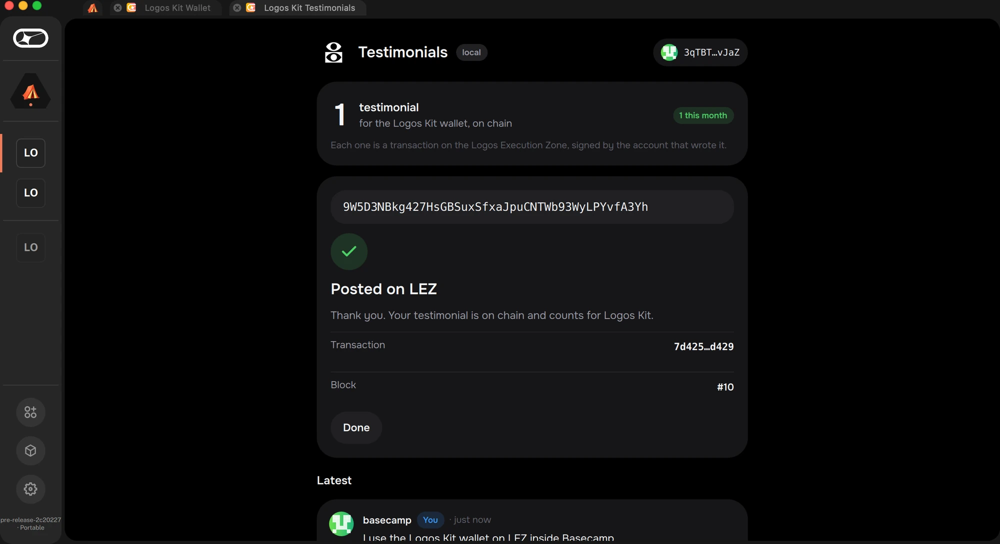

<p align="center">
  
</p>

<h1 align="center">Logos Kit</h1>

<p align="center">
  A wallet and an app SDK for the <b>Logos Execution Zone (LEZ)</b>.<br />
  Public and private accounts · approvals people can read · the calls your Basecamp app needs.
</p>

<p align="center">
  <a href="https://logos-kit-docs.vercel.app"><b>Docs</b></a> ·
  <a href="https://logos-kit-docs.vercel.app/docs/getting-started/quickstart">Quickstart</a> ·
  <a href="https://github.com/logos-kit/logos-kit-modules">Catalog</a> ·
  <a href="https://logos-kit-docs.vercel.app/docs/changelog">Changelog</a>
</p>

<p align="center">
  
</p>

Logos Kit is our entry for Logos λPrize **LP-0021, "LEZ Wallet and Provider SDK"**.
It is two things that ship together:

- **Logos Kit Wallet.** A Basecamp app (and a CLI) with public and private
  accounts, native LEZ and tokens, private transfers proved on your own
  machine, and approvals decoded from the exact message being signed, with
  the program's source verification.
- **The SDK.** What Basecamp apps (QML) use to ask the wallet for things:
  connect, read, propose transfers and program calls, and follow them to an
  outcome. A TypeScript client (`@logos-kit/client`, `@logos-kit/codec`) does
  typed chain reads and encoding from Node scripts and tools
  (`pnpm add @logos-kit/client @logos-kit/codec@^0.1.0`). Web (React) and React
  Native connect kits are planned, not shipped.

Keys, accounts and approvals live only in the wallet. Apps ask; the user decides.

> **Testnets only, unaudited.** The official LEZ testnet still runs 0.2, and
> Logos Kit is built on LEZ 0.3 (`v0.3.0-rc1`). Until the testnet moves to 0.3,
> everything runs on the Logos Kit **preview network** (below).

## Status

| | |
|---|---|
| Wallet in Basecamp | ✅ `logos_kit_wallet` + `logos_kit_wallet_ui` 0.1.2 in the [catalog](https://github.com/logos-kit/logos-kit-modules); signed; macOS arm64, Linux x86-64 and arm64 |
| Public, private and token flows | ✅ faucet, public send, shield, private → public, token public and private, on the live preview network with real proofs (`e2e/preview-flows.sh`) |
| Testimonial and faucet mini-apps | ✅ `logos_kit_testimonial`, `logos_kit_faucet` 0.1.0 in the catalog |
| QML SDK, dApp template | ✅ `sdk/qml/LogosKit`, `nix flake init -t github:logos-kit/logos-kit#dapp` |
| TypeScript client (Node/transport tooling) | ✅ on npm: `@logos-kit/client`, `codec`, `protocol`, `theme` 0.1.0 (codec awaiting npm's staged-release review; install `@^0.1.0`) |
| Conformance kit | ✅ fake wallet with 11 scenarios, `just conformance <dapp>` |
| Testimonial program | ✅ on the preview network (immutable, source-verified); ⏳ official testnet when it runs 0.3 |
| CI with the real-sequencer E2E | ⏳ S9 |
| Web (React) connect kit, React Native, passkey wallet | ⏳ planned (S10–S15) |

Progress in detail: [`PROGRESS.md`](PROGRESS.md) · plan: [`docs/dev/PLAN.md`](docs/dev/PLAN.md).

## Install the wallet (Basecamp)

1. In Basecamp: **Settings → Package Repositories → Add**:
   ```text
   https://raw.githubusercontent.com/logos-kit/logos-kit-modules/refs/heads/main/logos-repo.json
   ```
2. **Applications → Logos Kit Wallet → Install.** The core module comes with it.
   Logos Kit Testimonials and Logos Kit Faucet are in the same catalog.
3. Open it: **Create wallet** (write down the recovery phrase; it's shown once)
   or **Restore from recovery phrase**. **Add** (test funds) fills a public
   account from the preview network's faucet.

## Accounts

- **Public** accounts are visible on chain and send in seconds.
- **Private** accounts are visible only to you; sending from or into them is
  proved locally (about 4–7 minutes and ~4.3 GB of memory on an M-series Mac).
- Add either kind from the account menu, name them, switch with one click. All
  derive from one recovery phrase; restore finds your used accounts again.
- Transfers pick their route from the two accounts: public, **shield** (into
  your private account), **deshield**, or private to private.
- Apps see only the accounts you share, and private ones only as opaque
  per-app handles. Revoke apps in **Settings → Connected apps**.

## Use the CLI

The same engine, vault format and approval policy, from a terminal:

```sh
git clone https://github.com/logos-kit/logos-kit && cd logos-kit
cargo xtask lez-vendor                     # pinned LEZ + our patches into vendor/lez
cargo install --path crates/logos-kit-cli

logos-kit init                             # new wallet; shows the phrase once
logos-kit account new                      # public account
logos-kit account new --private            # private account
logos-kit faucet <public account>          # preview network faucet
logos-kit send --from <a> --to <b> --amount 42
logos-kit shield --from <public> --to <your private> --amount 5000
logos-kit token create --name KIT --supply 1000000 --holder <public>
logos-kit send --from <a> --to <b> --amount 250 --token <definition>
logos-kit testimonial post --from <public> --text "I use Logos Kit to …"
logos-kit backup export wallet.backup      # encrypted
```

Every command shows the decoded request, the fee cap and the request hash
before it asks. `--yes` works only with `LOGOS_KIT_PASSWORD` set. Full
reference: [CLI docs](https://logos-kit-docs.vercel.app/docs/wallet/cli).

## Networks (zones)

| Zone | Chain | Sequencer | Notes |
|---|---|---|---|
| `lez-preview` (default) | `lez:preview` | `https://lez.84.46.247.92.sslip.io` | Logos Kit's public LEZ 0.3 network, real proofs; faucet `https://lez-drip.84.46.247.92.sslip.io` |
| `lez-testnet` | `lez:testnet` | `https://testnet.lez.logos.co` | Official; still LEZ 0.2 today |
| `lez-local` | `lez:local` | `http://127.0.0.1:3040` | `e2e/standalone.sh` starts one |

Switch in the wallet (**Settings → Network**), or with `--zone` /
`LOGOS_KIT_ZONE` in the CLI. Any other zone: `--zone <id> --sequencer <url>`.
Apps built on the SDK follow the wallet's network. The preview network's
deployment is in [`deploy/preview-net`](deploy/preview-net); its faucet is
[`crates/logos-kit-drip`](crates/logos-kit-drip).

## Build a Basecamp app

```sh
mkdir my-app && cd my-app
nix flake init -t github:logos-kit/logos-kit#dapp
nix build .#lgx-portable                    # → result/*.lgx
lgpm install --file result/*.lgx            # or Basecamp: Package Manager → Install from file
```

```qml
import "LogosKit"

LogosKit { id: kit; visible: root.visible }

kit.api.connect({ accountKinds: ["public"] }).then(function (s) { account = s.accounts[0].address })
kit.api.transfer(account, to, "42").then(function (r) {
    kit.api.watchTransaction(r.handle, function (s) { status = s.lifecycle + " " + s.outcome })
})
```

Walkthroughs: [quickstart](https://logos-kit-docs.vercel.app/docs/getting-started/quickstart),
[testimonial app](https://logos-kit-docs.vercel.app/docs/guides/testimonial),
[faucet app](https://logos-kit-docs.vercel.app/docs/guides/faucet).
Test your app against the conformance fake: `just conformance <dapp dir>`.

## Build the modules from source (loadable assets)

Each Basecamp module builds to a portable `.lgx` you can install directly.
Build from a git checkout (the UI flakes refer to their sibling modules):

```sh
cd modules/logos_kit_wallet        && nix build .#lgx-portable   # core (Rust engine inside)
cd ../logos_kit_wallet_ui          && nix build .#lgx-portable   # wallet UI
cd ../logos_kit_testimonial        && nix build .#lgx-portable
cd ../logos_kit_faucet             && nix build .#lgx-portable
```

Install each `result/…lgx` with Basecamp's **Package Manager → Install from
file**, or `lgpm install --file <file>.lgx`. Releases to the catalog are
described in [`docs/dev/releasing.md`](docs/dev/releasing.md).

## Repository

| Path | What |
|---|---|
| `crates/` | `wallet-engine` (keys, vault, accounts, sync, policy, approvals, proving), `logos-kit` CLI, `logos-kit-drip` faucet, `xtask` |
| `modules/` | Basecamp modules: wallet core + UI, testimonial and faucet apps, the conformance fake |
| `sdk/qml/` | `LogosKit` (the QML SDK) and `LogosKitUi` (the wallet's look as components) |
| `packages/`, `protocol/` | `@logos-kit/client`, `@logos-kit/codec`, `@logos-kit/theme`; LWS-0 schema, fixtures and vectors |
| `programs/testimonial/` | The testimonial program (RISC Zero guest) with a reproducible build |
| `templates/basecamp-dapp/` | `nix flake init -t github:logos-kit/logos-kit#dapp` |
| `apps/docs/` | The docs site (Fumadocs, Next.js) |
| `e2e/` | End-to-end scripts against a standalone sequencer, real Basecamp and the preview network |
| `deploy/preview-net/` | The preview network (sequencer + faucet) on Coolify |

## Develop

```sh
pnpm install && pnpm build && pnpm check:types      # TypeScript
cargo xtask lez-vendor && cargo test -p wallet-engine --lib
just e2e-cli                                         # CLI flows on a local sequencer (dev-mode proofs)
e2e/preview-flows.sh --tokens-only                   # the live preview network, one real proof
(cd apps/docs && pnpm dev)                           # docs on :3000
```

Rules for contributors (humans and agents): [`AGENTS.md`](AGENTS.md),
[`CONTRIBUTING.md`](CONTRIBUTING.md), [`SECURITY.md`](SECURITY.md).

## Evaluate this submission

[](https://github.com/logos-kit/logos-kit/actions/workflows/rust.yml)
[](https://github.com/logos-kit/logos-kit/actions/workflows/e2e.yml)
[](https://github.com/logos-kit/logos-kit/actions/workflows/ts.yml)

`e2e/demo.sh` runs every wallet flow non-interactively and prints one pass/fail line per step: faucet, public send, shield, private send, token create and transfers, testimonial deploy and post, evidence export, and refused approvals. It runs on macOS arm64 and Linux x86_64/aarch64, checks the prerequisites and prints install commands for anything missing.

```sh
git clone https://github.com/logos-kit/logos-kit && cd logos-kit
e2e/demo.sh --local                 # a LEZ 0.3 sequencer built from the pinned source, dev proofs; no hosted services
e2e/demo.sh --local --real-proofs   # the same with real RISC Zero proofs (minutes per private step)
e2e/demo.sh --preview               # the public Logos Kit preview network (LEZ 0.3-rc1, real proofs)
```

CI runs the same flows against a standalone sequencer on every push (`.github/workflows/e2e.yml`). The official LEZ testnet still runs 0.2; the switch to it is [`docs/dev/cutover-0.3.md`](docs/dev/cutover-0.3.md).

## License

Dual-licensed under [MIT](LICENSE-MIT) and [Apache-2.0](LICENSE-APACHE), at your option.
